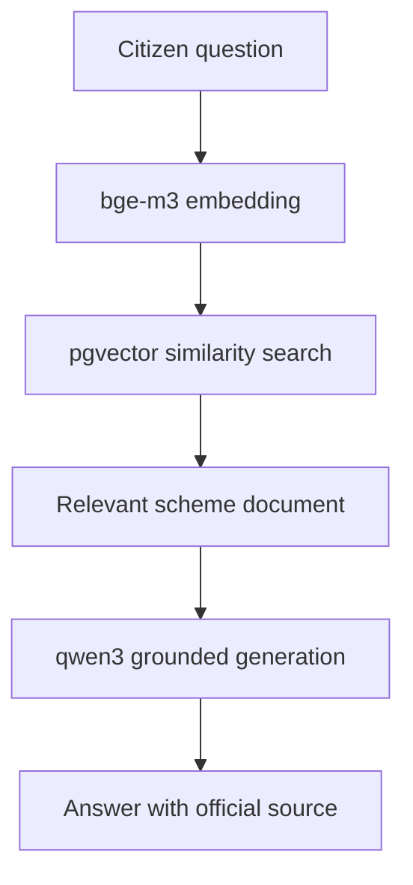
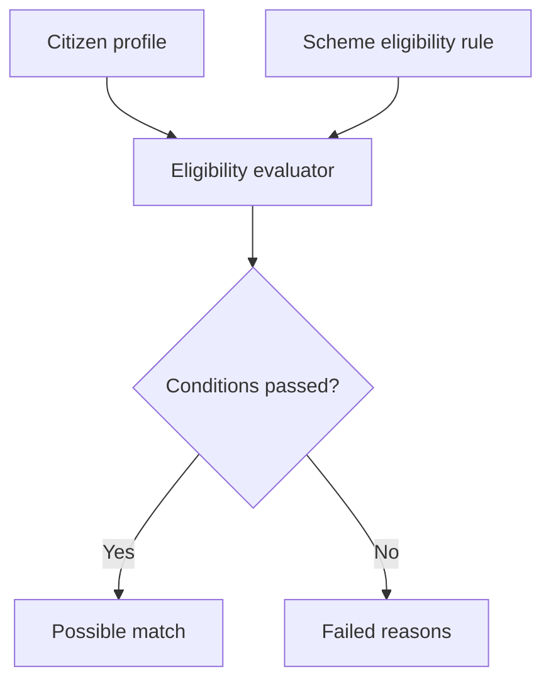
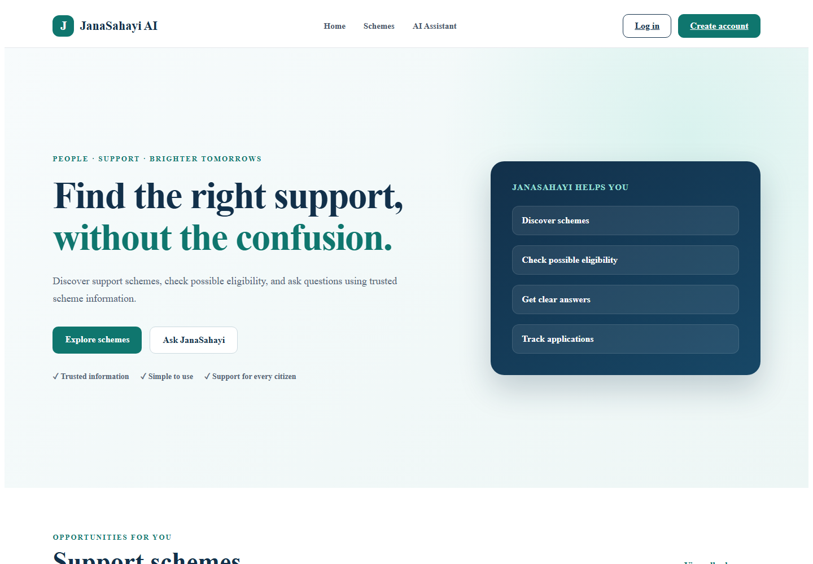
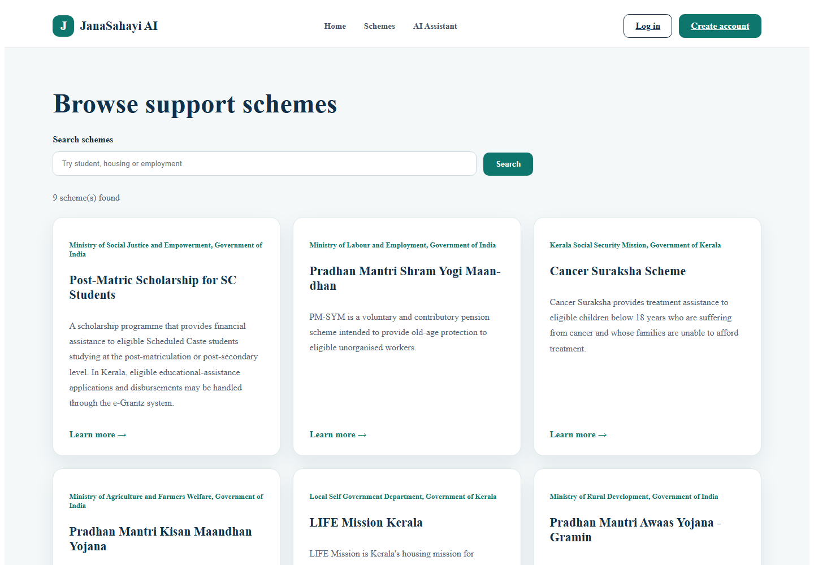
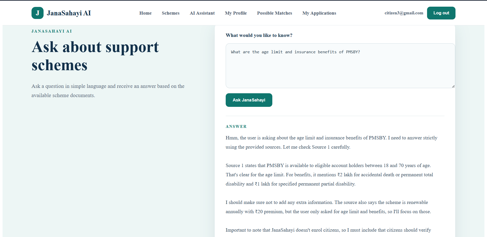
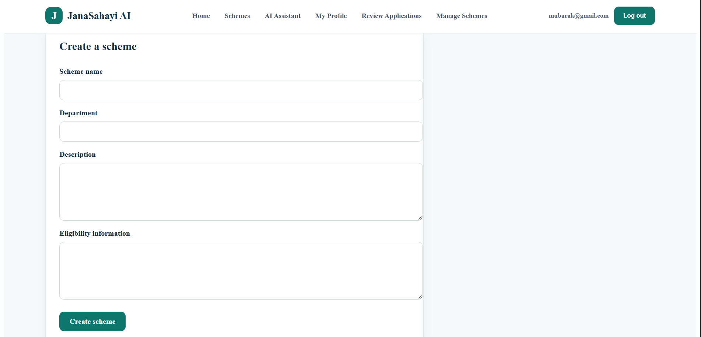

# JanaSahayi AI

JanaSahayi AI is a full-stack citizen-support platform that helps users discover welfare schemes, check possible eligibility, submit and track local applications, and ask questions using an AI-powered knowledge system.

The platform combines deterministic eligibility rules with Retrieval-Augmented Generation (RAG). Before producing an answer, it retrieves relevant information from stored scheme documents. This helps reduce unsupported or invented AI responses.

> **Important:** JanaSahayi is a portfolio and informational project. It is not an official government portal and does not submit applications to government systems. Citizens should verify information using the official source provided.

## Features

### Citizen features

- Create an account and log in securely
- Create and update a citizen profile
- Browse and search active schemes
- View individual scheme information
- Check possible eligibility
- View matched schemes
- Submit local scheme applications
- Track pending, approved and rejected applications
- Ask scheme-related questions through an AI assistant
- View the official source used for an AI answer

### Administrator features

- Create, update and deactivate schemes
- Create and update structured eligibility rules
- Review citizen applications
- Approve or reject applications
- Add official scheme knowledge documents
- Generate and store document embeddings
- View and deactivate knowledge documents

## Technology Stack

### Backend

- Python
- FastAPI
- SQLAlchemy
- Alembic
- PostgreSQL
- pgvector
- Pydantic
- JWT authentication
- pytest

### AI and RAG

- Ollama
- `bge-m3` embedding model
- `qwen3:4b` language model
- Vector similarity search
- Relevance filtering
- Grounded answer generation

### Frontend

- React
- Vite
- React Router
- CSS
- Fetch API

### Infrastructure

- Docker
- Docker Compose
- PostgreSQL with pgvector

## RAG Workflow



The language model does not answer directly from its general knowledge.

JanaSahayi first searches the stored scheme documents and sends only relevant information to the language model. When the retrieved information is not sufficiently relevant, the API returns:

```text
The available information is insufficient.
```

## Eligibility Workflow



A possible match is only guidance. Some official requirements—such as disability certificates, bank-account conditions, category certificates and property ownership—cannot currently be verified automatically.

## Screenshots

### Home Page



### Scheme Catalogue



### Grounded AI Assistant



### Administrator Scheme Management



## Project Structure

```text
JanaSahayi-AI/
├── backend/
│   ├── alembic/
│   ├── app/
│   │   ├── api/
│   │   ├── core/
│   │   ├── db/
│   │   ├── schemas/
│   │   └── services/
│   ├── tests/
│   ├── requirements.txt
│   └── alembic.ini
├── frontend/
│   ├── public/
│   ├── src/
│   │   ├── components/
│   │   ├── context/
│   │   ├── pages/
│   │   └── services/
│   ├── package.json
│   └── vite.config.js
├── docs/
│   └── screenshots/
├── docker-compose.yml
├── .env
└── README.md
```

The real `.env` file must remain excluded from Git.

## Local Setup

### Prerequisites

Install:

- Python 3.10 or later
- Node.js and npm
- Docker Desktop
- Ollama
- Git

### 1. Clone the repository

```bash
git clone https://github.com/muhammedmubarak1379/JanaSahayi-AI.git
cd JanaSahayi-AI
```

### 2. Create the root environment file

Create `.env` in the project root:

```env
POSTGRES_DB=janasahayi_db
POSTGRES_USER=janasahayi_user
POSTGRES_PORT=5432
POSTGRES_PASSWORD=replace_with_your_database_password
POSTGRES_HOST=127.0.0.1

JWT_SECRET_KEY=replace_with_a_secure_random_secret
JWT_ALGORITHM=HS256
ACCESS_TOKEN_EXPIRE_MINUTES=30

OLLAMA_BASE_URL=http://localhost:11434
EMBEDDING_MODEL=bge-m3
EMBEDDING_DIMENSION=1024
LLM_MODEL=qwen3:4b
```

Never commit the real `.env` file because it contains database and authentication secrets.

### 3. Start PostgreSQL

From the project root:

```bash
docker compose up -d
```

Verify that the database container is running:

```bash
docker ps
```

### 4. Configure the backend

Move into the backend directory:

```bash
cd backend
```

Create a Python virtual environment:

```powershell
py -3.10 -m venv .venv
```

Activate it:

```powershell
.\.venv\Scripts\Activate.ps1
```

Install backend dependencies:

```bash
pip install -r requirements.txt
```

### 5. Apply database migrations

From the `backend` directory:

```bash
python -m alembic upgrade head
```

Check migration consistency:

```bash
python -m alembic check
```

### 6. Install the Ollama models

```bash
ollama pull bge-m3
```

```bash
ollama pull qwen3:4b
```

Verify the models:

```bash
ollama list
```

Expected models include:

```text
bge-m3
qwen3:4b
```

### 7. Start the backend

From the `backend` directory:

```bash
python -m uvicorn app.main:app --reload
```

Backend API:

```text
http://127.0.0.1:8000
```

Interactive API documentation:

```text
http://127.0.0.1:8000/docs
```

Health endpoint:

```text
http://127.0.0.1:8000/health
```

### 8. Configure and start the frontend

Open another terminal:

```bash
cd frontend
```

Create `frontend/.env`:

```env
VITE_API_BASE_URL=http://127.0.0.1:8000
```

Install frontend dependencies:

```bash
npm install
```

Start the frontend:

```bash
npm run dev
```

Frontend URL:

```text
http://localhost:5173
```

### 9. Create a local administrator

Register a normal account using the JanaSahayi frontend.

For local development only, update that account’s role in PostgreSQL:

```powershell
docker exec janasahayi-postgres psql -U janasahayi_user -d janasahayi_db -c "UPDATE user_account SET role='admin' WHERE email='your-email@example.com';"
```

Log out and log in again so the new JWT contains the administrator role.

> Do not provide direct database access to users in a production system. This command is only for local development.

### 10. Add scheme information

After signing in as an administrator:

1. Open **Manage Schemes**.
2. Create a scheme.
3. Add an eligibility rule when the conditions can be represented by the available fields.
4. Add a knowledge document containing verified information.
5. Include the official source URL.
6. Test the document using the AI assistant.

## Testing

### Backend tests

From the `backend` directory:

```bash
python -m pytest
```

### Frontend production build

From the `frontend` directory:

```bash
npm run build
```

A successful build creates the `frontend/dist` directory.

## Main API Areas

| Area | Example path | Purpose |
|---|---|---|
| Authentication | `/auth` | Registration, login and current user |
| Profiles | `/profile/me` | Citizen profile management |
| Schemes | `/schemes` | Scheme catalogue and administration |
| Eligibility | `/schemes/{id}/eligibility-rule` | Structured eligibility rules |
| Matching | `/matching/schemes` | Citizen-to-scheme matching |
| Applications | `/applications` | Application submission and review |
| Documents | `/schemes/{id}/documents` | Knowledge-document management |
| Knowledge | `/knowledge/ask` | Grounded AI answers |
| Health | `/health` | Backend health check |

Complete API documentation is available at:

```text
http://127.0.0.1:8000/docs
```

## Data Model

Important database tables include:

- `user_account`
- `citizen_profile`
- `scheme`
- `scheme_eligibility_rule`
- `scheme_application`
- `scheme_document`
- `scheme_chunk`

Relationships include:

- One user can have one citizen profile.
- One citizen can apply for multiple schemes.
- A user cannot apply for the same scheme more than once.
- One scheme can have one structured eligibility rule.
- One scheme can have multiple knowledge documents.
- One document can contain multiple searchable chunks.
- Deleting a parent record removes its dependent records through database cascade rules.

The `scheme_chunk.embedding` column stores a 1024-dimensional vector generated by `bge-m3`.

## AI Answer Process

When a citizen asks a question:

1. The question is converted into a 1024-dimensional embedding.
2. PostgreSQL and pgvector compare it with stored document embeddings.
3. The most relevant active document chunks are retrieved.
4. A relevance threshold rejects unrelated results.
5. Relevant content is sent to `qwen3:4b`.
6. The generated answer is returned with the official source.

## AI Safety Measures

JanaSahayi uses several controls to reduce misleading answers:

- Answers are restricted to retrieved documents.
- A relevance threshold rejects unrelated questions.
- Inactive schemes are excluded from retrieval.
- Inactive documents are excluded from retrieval.
- Official source URLs are displayed with answers.
- The system prompt prevents invented rules and requirements.
- AI reasoning mode is disabled for faster factual answers.
- The frontend explains that eligibility results are only possible matches.

## Current Limitations

- Applications are stored only inside JanaSahayi.
- Applications are not submitted to government portals.
- Eligibility matching supports only the fields available in a citizen profile.
- JanaSahayi cannot verify certificates or official records.
- Knowledge documents must be reviewed and maintained by an administrator.
- Scheme information may change after it has been added.
- AI performance depends on available CPU, GPU and memory.
- Citizens must verify details through official government sources.

## Future Improvements

- Multilingual support, including Malayalam
- Additional citizen-profile attributes
- More detailed eligibility conditions
- Official portal integrations where permitted
- Document update and version history
- Password-reset and email-verification workflows
- Streaming AI responses
- Automated integration and end-to-end tests
- Production deployment and monitoring
- Administrator audit logs

## Security Notes

- Passwords are stored as secure hashes.
- Protected endpoints require a valid JWT access token.
- Administrator endpoints require role-based authorization.
- Database and JWT secrets are loaded from `.env`.
- The real `.env` file must never be committed.
- Input data is validated using Pydantic schemas.
- Database constraints protect important data rules.

## Author

**Muhammed Mubarak A**

- GitHub: [muhammedmubarak1379](https://github.com/muhammedmubarak1379)
- LinkedIn: [Muhammed Mubarak A](https://www.linkedin.com/in/muhammed-mubarak-a-303319289/)

## Disclaimer

JanaSahayi AI is an independent educational and portfolio project. It is not affiliated with or endorsed by any government department.

Scheme information belongs to the respective authorities and may change over time. Users must verify eligibility, benefits, documents and application procedures through the official source before making decisions.